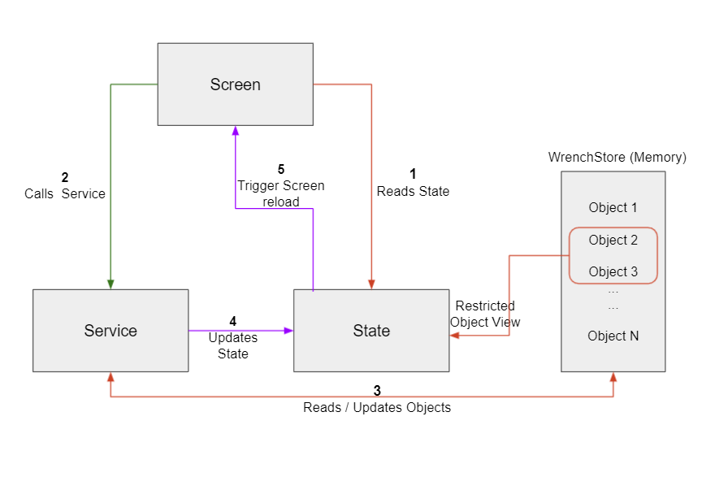
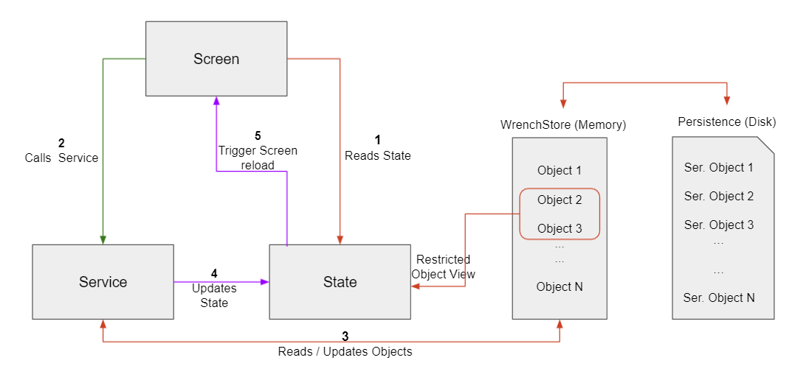
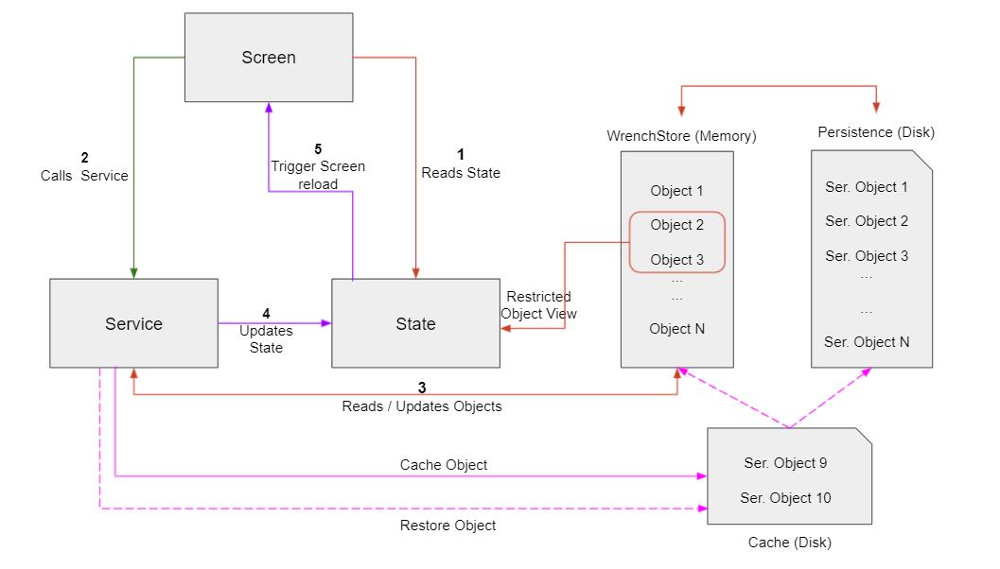

# Mustang


A framework to build Flutter applications. Following features are available out of the box.

- State Management
- Persistence
- Cache
- File layout and naming standards
- Reduces boilerplate
- Generates source templates using `cli` (https://bitbucket.org/lunchclub/mustang_cli/src/master)

## Contents
- [Framework Components](#markdown-header-framework-components)
- [Component Communication](#markdown-header-component-communication)
- [Persistence](#markdown-header-persistence)
- [Cache](#markdown-header-cache)
- [Model](#markdown-header-model)
- [State](#markdown-header-state)
- [Service](#markdown-header-service)
- [Screen](#markdown-header-screen)
- [Folder Structure](#markdown-header-folder-structure)
- [Quick Start](#markdown-header-quick-start)
- [Resources](#markdown-header-resources)

### Framework Components
- **Screen** - Represents a screen in the app or a page in Browser.

- **Model** - A Dart class representing application data.

- **State** - Provides access to subset of `Models` needed for a `Screen`. It is a Dart class with _1 or more_ `Model` fields.

- **Service** - A Dart class for async communication and business logic.

### Component Communication
- Every `Screen` has a corresponding `Service` and a `State`. All three components work together to continuously
rebuild the UI whenever there is a change in the application state.

    

    1. `Screen` reads `State` while building the UI
    2. `Screen` invokes methods in the `Service` as a response to user events (`scroll`, `tap` etc.,)
    3. `Service` 
        - reads/updates `Models` in the `WrenchStore`
        - makes API calls, if needed
        - informs `State` if `WrenchStore` is mutated
    4. `State` informs `Screen` to rebuild the UI
    5. Back to Step 1

### Persistence



By default, `app state` is maintained in memory by `WrenchStore`. When the app is terminated, the `app state` is lost
permanently. However, there are cases where it is desirable to persist and restore the `app state`. For example,

- Save and restore user's session token to prevent user having to log in everytime
- Save and restore partial changes in a screen so that the work can be resumed from where the user has left off. 

Enabling persistence is simple and works transparently.
    
```dart
// In main.dart before calling runApp method,
// 1. Enable persistence like below
WrenchStore.config(
  isLarge: true,
  isPersistent: true,
  persistentStoreName: 'myapp',
);

// 2. Initialize persistence
Directory dir = await getApplicationDocumentsDirectory();
await WrenchStore.initPersistence(dir.path);

// 3. Restore persisted state into WrenchStore
await WrenchStore.restoreState(.., ..);
```

With the above change, `app state` (`WrenchStore`) is persisted to the disk and will be restored into `WrenchStore` when the app is started.

### Cache



`Cache` feature allows switching between instances of the same type on need basis.

`Persistence` is a snapshot of the `app state` in memory (`WrenchStore`). However, there are times when data
need to be persisted but restored only when needed. An example would be a technician working on multiple jobs at the same time i.e, technician switches between jobs.
Since the `WrenchStore` allows only one instance of a type, there cannot be two instances of the Job object in the WrenchStore.

`Cache` APIs, available in `Service`s, make it easy to restore any instance into memory (`WrenchStore`).

- ```
  Future<void> addObjectToCache<T>(String key, T t)
  ```
  Save an instance of type `T` in the cache. `key` is an identifier for one or more cached objects.

- ```
  Future<void> deleteObjectsFromCache(String key)
  ```
  Delete all cached objects having the identifier `key`

- ```
  static Future<void> restoreObjects(
      String key,
      void Function(
          void Function<T>(T t) update,
          String modelName,
          String jsonStr,
      ) callback,
  )
  ```
  Restores all objects in the cache identified by the `key` into memory `WrenchStore` and also into the persisted store
so that the in-memory and persisted app state remain consistent.

- ```
  bool itemExistsInCache(String key)
  ```
  Returns `true` if an identifier `key` exists in the Cache, `false` otherwise.

### Model
- A Class annotated with `appModel`
- Model name should start with `$`
- Initialize fields with `InitField` annotation
- Methods/Getters/Setters are `NOT` supported inside `Model` classes
- If a field should be excluded when a `Model` is persisted, annotate that field with `SerializeField(false)`
    
    ```dart
    @appModel
    class $User {
      String name;
    
      int age;
    
      @InitField(false)
      bool admin; 
    
      @InitField(['user', 'default'])
      BuiltList<String> roles;
      
      $Address address;  // $Address is another model annotated with @appModel
      
      BuiltList<$Vehicle> vehicles;  // Use immutable versions of List/Map inside Model classes
      
      @SerializeField(false)
      String errorMsg; // errorMsg field will not be included when $User model is persisted 
    }
    ```
  
### State
- A class annotated with `screenState`
- State name should start with `$`
- Fields of the class must be `Model` classes

  
    ```dart      
    @screenState
    class $ExampleScreenState {
      $User user;
      
      $Vehicle vehicle;
    }
    ```
    
### Service
- A class annotated with `ScreenService`
- Provide `State` class as an argument to `ScreenService` annotation, to create an association between `State` and `Service` as shown below.
  
    ```dart
    @ScreenService(screenState: $ExampleScreenState)
    class ExampleScreenService {
      void getUser() {
        User user = WrenchStore.get<User>() ?? User();
          updateState1(user);
        }
    }
    ```
    
- Service also provides following APIs
    - `updateState` -  Updates screen state and/or re-build the screen. To update the `State` without re-building the screen. Set `reload` argument to `false` to update the `State` without re-building the `Screen`.
        - `updateState()`
        - `updateState1(T model1, { reload: true })`
        - `updateState2(T model1, S model2, { reload: true })`
        - `updateState3(T model1, S model2, U model3, { reload: true })`
        - `updateState4(T model1, S model2, U mode3, V model4, { reload: true })`

    - `memoizeScreen` - Invokes any method passed as argument only once.
        - `T memoizeScreen<T>(T Function() methodName)`
            ```dart
            // In the snippet below, getScreenData method caches the return value of getData method, a Future.
            // Even when getData method is called multiple times, method execution happens only the first time.
            Future<void> getData() async {
              Common common = WrenchStore.get<Common>() ?? Common();
              User user;
              Vehicle vehicle;

              ...   
            }

            Future<void> getScreenData() async {
              return memoize(getData);
            }
            ```
    - `clearMemoizedScreen` - Clears value cached by `memoizeScreen` method.
        - `void clearCache()`
            ```dart
            Future<void> getData() async {
              ...
            }

            Future<void> getScreenData() async {
              return memoizeScreen(getData);
            }

            void resetScreen() {
              // clears Future<void> cached by memoizeScreen()
              clearMemoizedScreen();
            }
            ``` 

### Screen
- Use `StateProvider` widget to re-build the `Screen` automatically when there is a change in `State`
  
    ```dart
    ...
    Widget build(BuildContext context) {
      return StateProvider<HomeScreenState>(
          state: HomeScreenState(),
          child: Builder(
            builder: (BuildContext context) {
              // state variable provides access to model fields declared in the HomeScreenState class
              HomeScreenState state = StateConsumer<HomeScreenState>().of(context);
              
              # Even when this widget is built many times, only 1 API call 
              # will be made because the Future from the service is cached
              SchedulerBinding.instance.addPostFrameCallback(
                (_) => HomeScreenService().getScreenData(),
              );
    
              if (state?.common?.busy ?? false) {
                return Spinner();
              }
    
              if (state.common?.errorMsg != null) {
                return ErrorBody(errorMsg: state.common.errorMsg);
              }
                
              return _body(state, context);
            },
          ),
        );
      }
    ```

### Folder Structure
- Folder structure of a Flutter application created with this framework looks as below
    ```
      lib/
        - main.dart
        - src
          - models/
            - model1.dart
            - model2.dart
          - screens/
            - first/
              - first_screen.dart
              - first_state.dart
              - first_service.dart
            - second/
              - second_screen.dart
              - second_state.dart
              - second_service.dart
    ```
- Every `Screen` needs a `State` and a `Service`. So, `Screen, State, Service` files are grouped inside a directory
- All `Model` classes must be inside `models` directory


### Quick Start
- Install Flutter
  ```bash
    mkdir -p ~/lib && cd ~/lib
    
    git clone https://github.com/flutter/flutter.git -b stable

    # Add PATH in ~/.zshrc 
    export PATH=$PATH:~/lib/flutter/bin
    export PATH=$PATH:~/.pub-cache/bin
  ```
    
- Install Mustang CLI
  ```bash
    dart pub global activate -sgit git@bitbucket.org:lunchclub/mustang_cli.git
  ```
  
- Create Flutter project
  ```bash
    cd /tmp
    
    flutter create quick_start
    
    cd quick_start
    
    # Open the project in editor of your choice
    # vscode - code .
    # IntelliJ - idea .
  ```

- Update `pubspec.yaml`
  ```yaml
    environment:
      sdk: '>=2.7.0 <3.0.0' # this is needed to turn off Dart's sound null safety
  
    dependencies:
      ...
      built_collection: ^5.0.0
      built_value: ^8.0.0
      mustang_core:
        git:
          url: git@bitbucket.org:lunchclub/mustang.git
          path: mustang_core
          ref: master

    dev_dependencies:
      ...
      build_runner: ^2.0.4
      mustang_codegen:
        git:
          url: git@bitbucket.org:lunchclub/mustang.git
          path: mustang_codegen
          ref: master 
      pedantic: ^1.11.0    
  ```
  
- Install dependencies
  ```bash
    flutter pub get
  ```

- Generate files for a screen called `counter`. Following command creates file representing a `Model`, and also files representing `Screen`, `Service` and `State`.
  ```bash
    mcli -s counter
  ```

- Generate runtime files and watch for changes. 
  ```bash
    mcli -w # mcli -b to generate runtime files without watch mode
  ```
  
- Update the generated `counter.dart` model
  ```dart
    class $Counter {
      @InitField(0)
      int value;
    }
  ```
  
- Update the generated `counter_screen.dart` screen
  ```dart
    import 'package:flutter/material.dart';
    import 'package:mustang_core/mustang_widgets.dart';
    
    import 'counter_service.dart';
    import 'counter_state.state.dart';
    
    class CounterScreen extends StatelessWidget {
      const CounterScreen({
        Key key,
      }) : super(key: key);
        
      @override
      Widget build(BuildContext context) {
        return StateProvider<CounterState>(
          state: CounterState(),
          child: Builder(
            builder: (BuildContext context) {
              CounterState state = StateConsumer<CounterState>().of(context);
              return _body(state, context);
            },
          ),
        );
      }
    
      Widget _body(CounterState state, BuildContext context) {
        int counter = state?.counter?.value ?? 0;
        return Scaffold(
          appBar: AppBar(
            title: Text('Counter'),
          ),
          body: Center(
            child: Column(
              children: [
                Padding(
                  padding: const EdgeInsets.all(8.0),
                  child: Container(
                    child: Text('$counter'),
                  ),
                ),
                ElevatedButton(
                  onPressed: CounterService().increment,
                  child: Text('Increment'),
                ),
              ],
            ),
          ),
        );
      }
    }
  ```
  
- Update the generated `counter_service.dart` service
  ```dart
    import 'package:mustang_core/mustang_core.dart';
    import 'package:quick_start/src/models/counter.model.dart';
        
    import 'counter_service.service.dart';
    import 'counter_state.dart';
        
    @ScreenService(screenState: $CounterState)
    class CounterService {
      void increment() {
        Counter counter = WrenchStore.get<Counter>() ?? Counter();
        counter = counter.rebuild((b) => b.value = b.value + 1);
        updateState1(counter);
      }
    }
  ```
  
- Update `main.dart`
  ```dart
    ...
  
    Widget build(BuildContext context) {
      return MaterialApp(
        title: 'Flutter Demo',
        theme: ThemeData(
          ...
          primarySwatch: Colors.blue,
        ),
        home: CounterScreen(), // Point to Counter screen
      );
    }
  
    ...  
  ```
    
### Resources
- Presentation: https://docs.google.com/presentation/d/19VSU_TsbtzKUtKsblheX399KsqTTjPV_AWZNE2vthqM/edit?usp=sharing
- Video: https://drive.google.com/file/d/1zoTbw5pjLIBxlJD6NquAmHeGVuA4R8co/view?usp=sharing  

